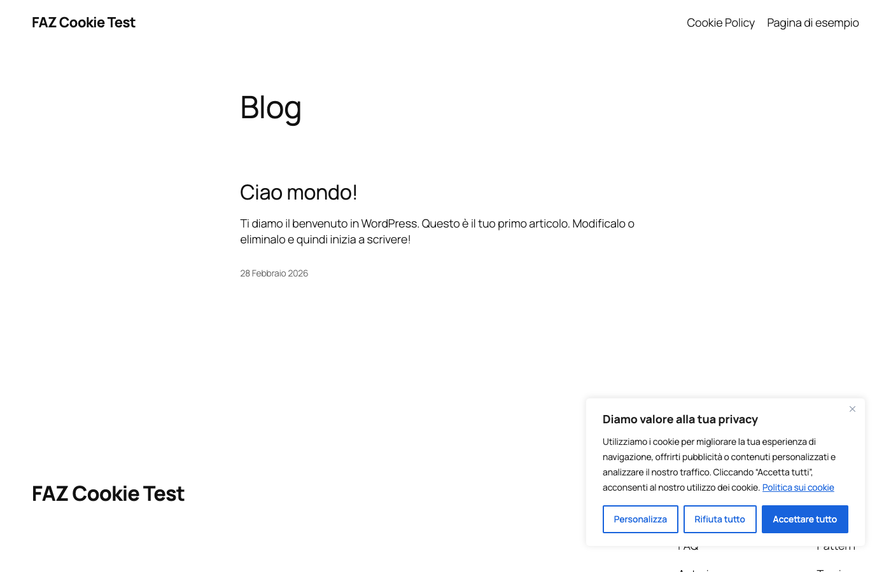
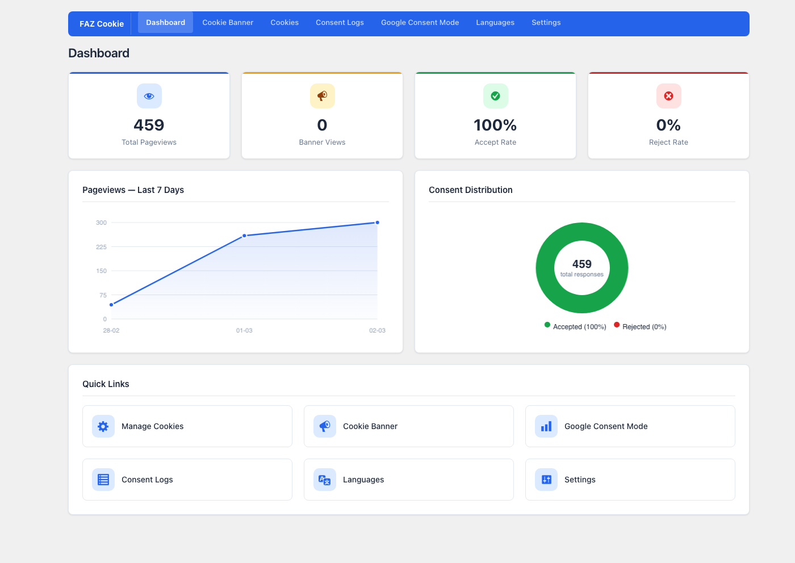
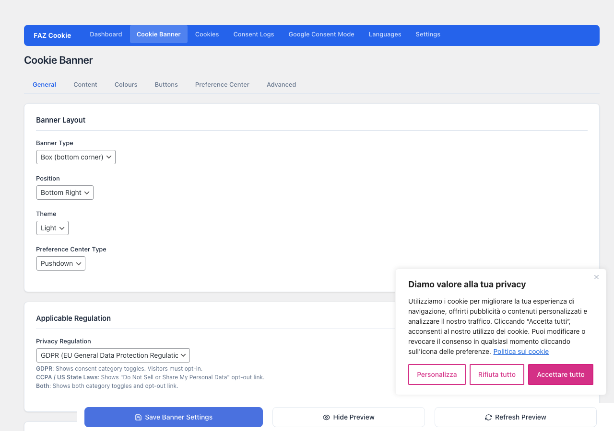
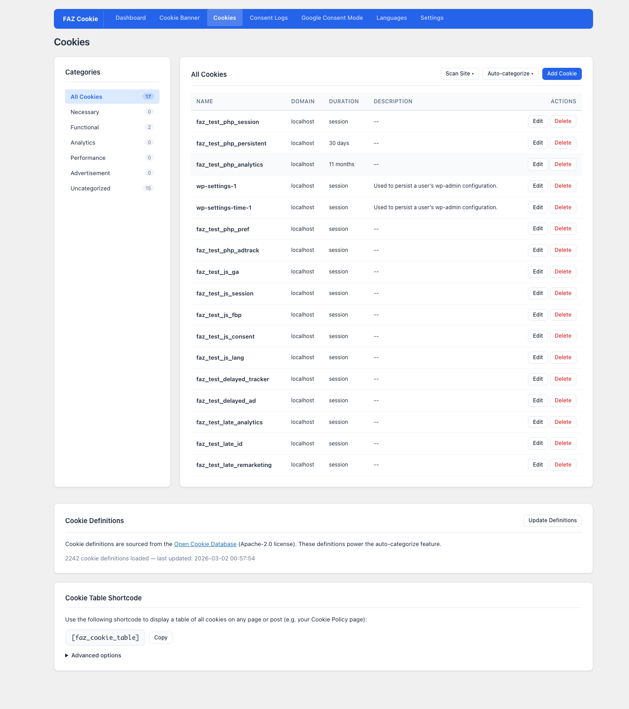
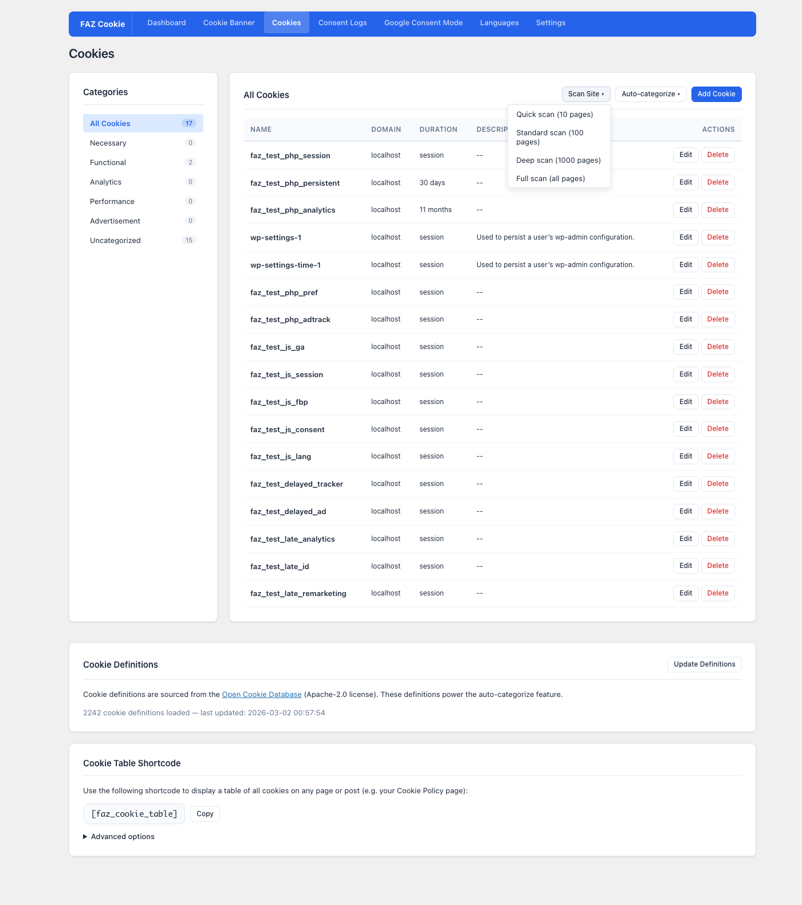
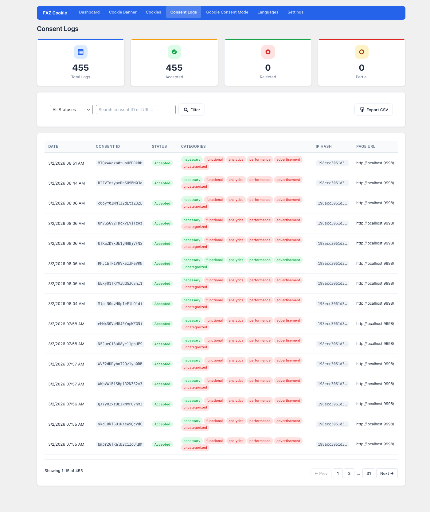
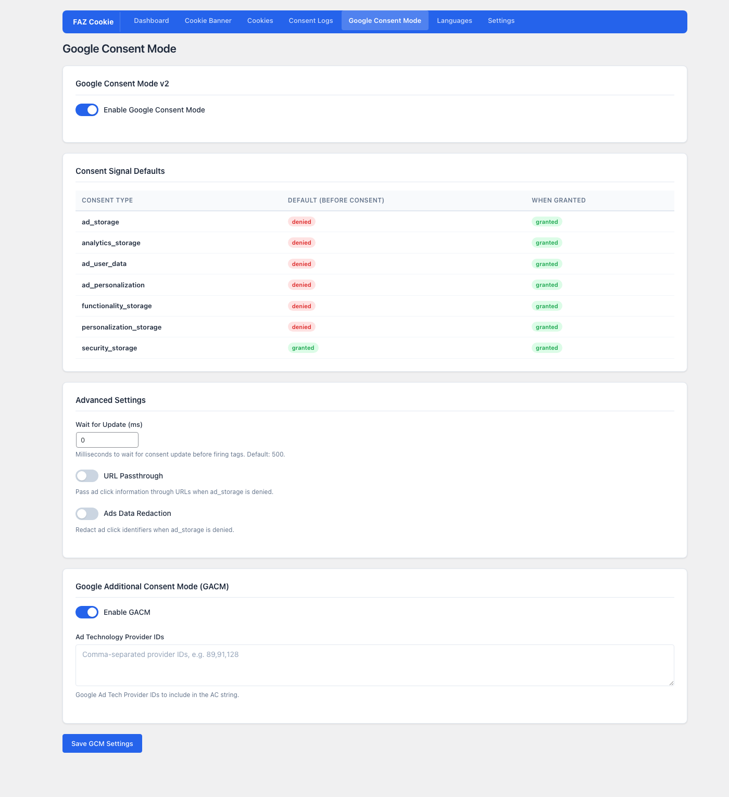
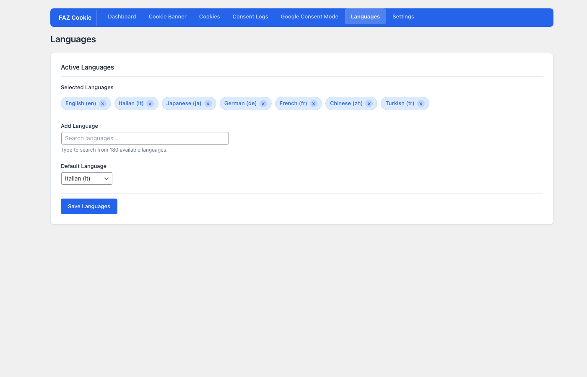
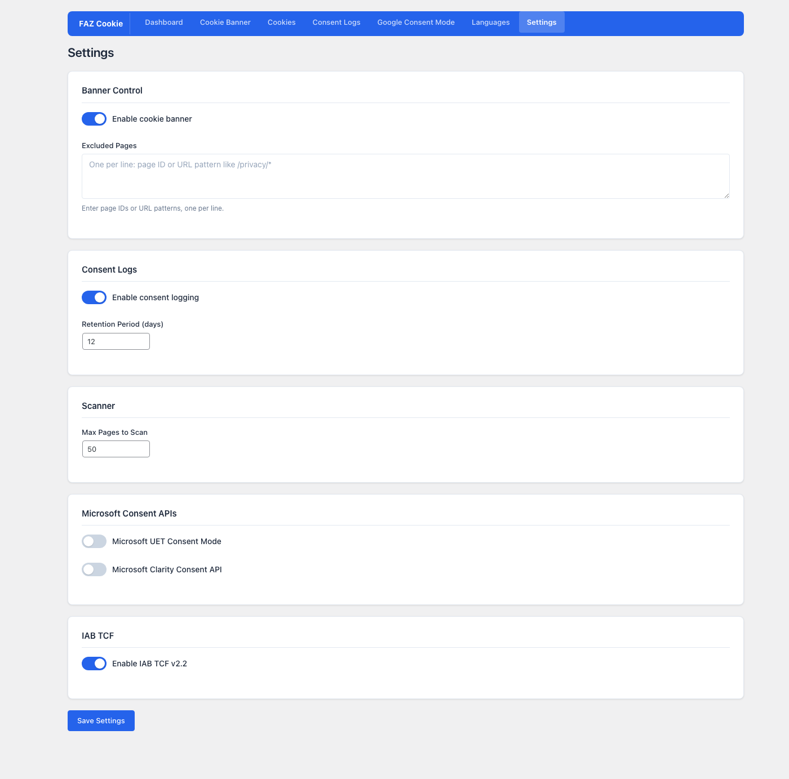

# FAZ Cookie Manager

**The only cookie consent plugin you need. 100% free, zero cloud dependencies, no subscriptions.**

---

**Tired of cookie consent plugins that lock essential features behind paywalls, require cloud accounts, or send your visitors' data to third-party servers?**

FAZ Cookie Manager is a WordPress plugin that gives you everything you need to make your site compliant with international privacy regulations -- completely free, with no strings attached.

No account to create. No cloud service to connect. No "premium" plan to unlock basic features like consent logging or geo-targeting. Everything runs on your own server, and you own all your data.

## Why FAZ Cookie Manager?

Most cookie consent plugins follow the same pattern: a free version with crippled features, and a paid tier starting at $10-50/month that unlocks what you actually need. FAZ Cookie Manager breaks that model:

| Feature | Others (free) | Others (paid) | FAZ Cookie Manager |
|---|---|---|---|
| Cookie banner | Limited | Full | **Full** |
| Cookie scanner | No | Yes | **Yes** |
| Consent logging + CSV export | No | Yes | **Yes** |
| Google Consent Mode v2 | No | Yes | **Yes** |
| IAB TCF v2.3 + GVL | No | Yes | **Yes** |
| Geo-targeting | No | Yes | **Yes** |
| Multi-language (180+) | No | Yes | **Yes** |
| Cloud dependency | No | **Yes** | **No** |
| Price | Free | $10-50/mo | **Free forever** |

> **A note on IAB TCF v2.3:** The plugin includes a fully functional IAB TCF v2.3 CMP implementation -- TC String encoding, GVL integration, vendor consent UI, and all required `__tcfapi()` commands work correctly. However, for the TC String to be recognized by the ad-tech supply chain, the CMP must be registered with IAB Europe (which requires an annual fee). CMP registration is on the roadmap. If you'd like to help make it happen, consider supporting the project:
>
> 

---

## Screenshots

### Cookie Consent Banner
GDPR-compliant banner with Customize, Reject All, and Accept All buttons. Appears on first visit, fully responsive and keyboard accessible.

### Dashboard
Analytics overview with pageviews chart, consent distribution (accept/reject rates), and quick links to all plugin sections.

### Cookie Banner Editor
Customize layout (box, bar, popup), position, theme (light/dark), and regulation type (GDPR/CCPA/both) with a live preview. Includes tabs for Content, Colours, Buttons, Preference Center, and Advanced settings.

### Cookies Management
View all detected cookies organized by category (Necessary, Functional, Analytics, Performance, Advertisement). Edit, delete, or add cookies manually. Integrated with the Open Cookie Database (2,242 definitions) for automatic categorization.

### Cookie Scanner
Built-in browser-based scanner with multiple scan depths: Quick (10 pages), Standard (100), Deep (1,000), or Full scan. Runs locally -- no external service, no API limits.

### Consent Logs
Complete audit trail of every visitor's consent decision. Shows consent ID, status, categories chosen, anonymized IP, and page URL. Search, filter, and export to CSV for GDPR accountability.

### Google Consent Mode v2
Configure all 7 consent signal types with default and granted states. Includes Google Additional Consent Mode (GACM) for ad technology provider IDs.

### Languages
Select from 180+ available languages. The banner text adapts automatically to the visitor's browser language.

### Settings
Global controls: enable/disable banner, exclude pages, consent log retention, scanner limits, Microsoft UET/Clarity consent APIs, and IAB TCF v2.3 toggle with CMP ID and Purpose One Treatment options.

---

## Compliance

| Standard | Status | Details |
|----------|--------|---------|
| GDPR (EU) | Compliant | Opt-in model, granular consent, right to withdraw |
| ePrivacy Directive | Compliant | No cookies before consent, script blocking |
| CCPA / CPRA (California) | Supported | "Do Not Sell" opt-out, GPC signal detection |
| Garante Privacy LG 2021 (Italy) | Compliant | Equal-weight buttons, no scroll-as-consent, 6-month max expiry |
| EDPB Guidelines | Compliant | Scroll != consent, no pre-checked categories, equal button prominence |
| IAB TCF v2.3 | Compliant | Full `__tcfapi()` CMP, GVL integration, real vendor consent, DisclosedVendors segment |
| Google Consent Mode v2 | Compliant | Default-denied signals, consent update on interaction |
| LGPD (Brazil) | Supported | Consent-based model |
| POPIA (South Africa) | Supported | Opt-in consent |
| WCAG 2.1 AA | Partial | Keyboard navigation, focus indicators, ARIA labels |
| WP Consent API | Compliant | Registered via `wp_consent_api_registered_` filter |

> **Legal Disclaimer:** Compliance status depends on correct plugin configuration for your specific use case and does not constitute a legal guarantee. This table is for informational purposes only and is not legal advice. Consult a qualified legal professional for your jurisdiction.

### Automated Compliance Tests

Playwright tests verify compliance at runtime:

- TF01-TF18: Full functional test suite covering banner display, cookie blocking, consent flow, mobile, accessibility, revocation, logging, GCM signals, and cookie declarations
- P05: No ambiguous button labels (dark pattern check)
- G07: Non-technical toggles OFF by default
- I08: Technical cookies non-disableable
- T01-T03: IAB TCF `__tcfapi` CMP stub, TC String format, cross-frame messaging
- GCM01-GCM05: Google Consent Mode default-denied, granted on accept, revocation
- CD01-CD03: Cookie declarations, descriptions, categories
- VIS01-VIS09: Visual integrity checks across banner types and preference centers
- IAB01-IAB39: IAB Settings page, GVL admin page, vendor selection, TC String validation

**The test suite includes automated compliance checks across frontend, admin, scanner, GCM/TCF, visual integrity, and IAB flows.**

---

## Installation

1. Download the latest release from [GitHub Releases](https://github.com/fabiodalez-dev/FAZ-Cookie-Manager/releases)
2. Upload the `faz-cookie-manager` folder to `/wp-content/plugins/`
3. Activate in WordPress admin > Plugins
4. Go to **FAZ Cookie** in the admin sidebar
5. Click **Scan Site** on the Cookies page to detect cookies
6. Customize banner design, text, and regulation type

### Requirements

- WordPress 5.0+
- PHP 7.4+
- MySQL/MariaDB
- No external services required (except optional: GitHub for cookie database updates, ip-api.com for geolocation fallback)

---

## Features (detailed)

### Cookie Banner

- **Three banner types**: Classic (bar), Popup (modal), Box (widget)
- **Configurable position**: Top, bottom, or any corner
- **Three legislation modes**: GDPR (opt-in), CCPA (opt-out), Info-only
- **Preference center**: Granular per-category toggles with cookie audit tables
- **Full color customization**: Background, text, button colors via color pickers
- **Theme presets**: Light and dark themes
- **Brand logo**: Upload custom logo via WordPress Media Library
- **Live preview**: Real-time banner preview in admin as you edit
- **Responsive**: Adapts to mobile viewports, tested on 375px width
- **RTL support**: Arabic, Hebrew, Persian, Urdu, and other RTL languages
- **Consent expiry**: Capped at 180 days per Garante Privacy requirements
- **Revisit widget**: Floating button to reopen preferences after consent
- **Video placeholder**: Blocks YouTube/Vimeo embeds until consent
- **Page exclusions**: Skip banner on specific pages (supports wildcards)
- **Subdomain sharing**: Share consent across subdomains
- **Reload on accept**: Optional page reload after consent

### Buttons

- **Accept All** -- grants consent to all categories
- **Reject All** -- denies all non-necessary categories (equal visual weight as Accept)
- **Customize / Settings** -- opens preference center for granular control
- **Read More** -- links to privacy policy (configurable: button or link, nofollow, new tab)
- **Do Not Sell** -- CCPA opt-out button (only in CCPA mode)

### Cookie Management

- **Cookie list**: Full CRUD for cookies -- name, domain, duration, description, category, URL pattern
- **Cookie categories**: Necessary, Functional, Analytics, Performance, Advertisement, Uncategorized
- **Per-category prior consent**: Each category has a configurable `prior_consent` flag. Set to OFF for first-party analytics cookies that meet the Garante Privacy exemption (first-party only, aggregated data, anonymized IP, no cross-referencing)
- **Audit table**: Per-category cookie listing embedded in the preference center
- **Multilingual descriptions**: Cookie description and duration stored per-language

### Cookie Scanner

A fully local browser-based cookie crawler -- no external scanning service.

- Discovers pages via sitemap.xml parsing + homepage link extraction
- Scans pages in iframes to detect all cookies
- Configurable scan depth: Quick (10), Standard (100), Deep (1000), Full
- Deduplicates -- never overwrites existing cookie entries
- Scan history with results

### Open Cookie Database

Integrates the [Open Cookie Database](https://github.com/fabiodalez-dev/Open-Cookie-Database) (Apache-2.0) for automatic cookie identification.

- **2,200+ cookie definitions** from major platforms (Google, Facebook, Microsoft, Stripe, etc.)
- **Auto-download** on first activation
- **Manual update** via admin UI button
- **Exact + wildcard matching**: e.g., `_gat_` prefix matches `_gat_UA-12345`
- **Auto-categorize**: One-click bulk categorization

### Google Consent Mode v2

Full GCM v2 integration with all required consent signals:

- `ad_storage`, `analytics_storage`, `functionality_storage`, `personalization_storage`, `security_storage`
- `ad_user_data`, `ad_personalization` (v2 additions)
- **Default: all denied** -- updates to granted on consent
- **Wait for update** -- configurable delay (ms) for slow-loading CMPs
- **URL passthrough** -- pass ad click info even when consent denied
- **Ads data redaction** -- redact ad data when consent denied

### Google Additional Consent Mode (GACM)

- Enable/disable toggle
- Configure ATP (Authorized Technology Provider) IDs
- Generates Additional Consent string format: `1~id.id.id...`

### IAB TCF v2.3 CMP with Global Vendor List

Full `__tcfapi()` implementation compliant with the IAB Transparency & Consent Framework v2.3:

- **Commands**: `ping`, `getTCData`, `addEventListener`, `removeEventListener`, `getVendorList`
- **Global Vendor List (GVL)**: Server-side download and caching of the IAB GVL v3 (1,100+ vendors). Weekly auto-update via WP-Cron, manual update from admin UI
- **GVL Admin Page**: Browse, search, and filter all IAB-registered vendors. Select which vendors your site uses. Paginated table with purpose/feature details
- **Real Vendor Consent**: TC Strings encode actual vendor consent and legitimate interest bits based on user choices and vendor purpose declarations
- **Special Feature Opt-ins**: TCF v2.3 Special Features (precise geolocation, device scanning) mapped from user category consent
- **DisclosedVendors Segment**: Mandatory segment listing all vendors the CMP discloses to users
- **Vendor Legitimate Interest**: Honors user's Right to Object -- LI bits are only set when the user hasn't objected to the corresponding purposes
- **Vendor Consent UI**: Per-vendor toggles in the preference center, with vendor name, purposes, privacy policy link, and cookie retention info
- **TC String**: Full base64url encoding with core segment + DisclosedVendors segment, `euconsent-v2` cookie
- **Cross-frame messaging**: `__tcfapiLocator` iframe + `postMessage` bridge
- **Command queue**: Processes pre-load `__tcfapi.a` queue
- **CMP Stub**: Inline stub responds to `ping` before main script loads (`cmpStatus: 'stub'`)
- **Dynamic config**: ConsentLanguage, publisherCC, gdprApplies, CMP ID, Purpose One Treatment -- all configured from server-side settings
- **GVL file storage**: Cached at `wp-content/uploads/faz-cookie-manager/gvl/vendor-list.json` for frontend access

#### CMP ID and IAB Registration

FAZ Cookie Manager works in two modes:

| Mode | CMP ID | What works | What doesn't |
|------|--------|------------|--------------|
| **Self-hosted** (default) | `0` | Banner, cookie blocking, Google Consent Mode v2, consent logging, all admin features | Ad-tech vendors ignore the TC String (unrecognized CMP) |
| **IAB-registered** | Your ID | Everything above **plus** full TCF vendor chain -- SSPs, DSPs, and ad exchanges read and honor the TC String | Requires [IAB CMP registration](https://iabeurope.eu/cmp-list/) (annual fee) |

**When do you need a registered CMP ID?**

- If you run programmatic advertising (header bidding, ad exchanges) and need the buy-side to respect granular vendor consent via the TC String
- If your DPA or legal counsel requires a registered CMP for TCF compliance

**When is self-hosted (CMP ID = 0) sufficient?**

- You only need GDPR/ePrivacy-compliant cookie consent (banner + script blocking)
- You use Google Consent Mode v2 (GCM uses its own consent signal channel, independent of TCF)
- You don't participate in the IAB programmatic advertising supply chain

To set your CMP ID: **Settings > IAB TCF v2.3 > CMP ID**

### Microsoft Consent Integration

- **UET Consent Mode**: Sets `ad_storage`/`analytics_storage` defaults to denied, updates on consent
- **Clarity Consent API**: Calls `window.clarity('consent')` when analytics accepted

### Consent Logging

Stores proof of consent in a local database table for GDPR accountability:

- **Consent ID**: Unique per-visitor identifier
- **Status**: accepted, rejected, or partial
- **Categories**: JSON map of which categories were accepted/rejected
- **IP hash**: SHA256 hash (privacy-preserving, no raw IPs stored)
- **Pagination** and **search** in admin UI
- **CSV export** with date-stamped filename
- **Retention period**: Configurable (default: 12 months)

### Pageview Analytics

Built-in analytics dashboard -- no Google Analytics needed for basic metrics:

- **Events tracked**: pageview, banner_view, banner_accept, banner_reject, banner_settings
- **Dashboard charts**: Daily pageview trend, accept/reject rates

### Geolocation

Detects visitor country for geo-targeted banner display:

- **Detection chain**: Cloudflare > Apache mod_geoip > PHP GeoIP extension > ip-api.com
- **Geo-targeting modes**: ALL (everyone), EU (EU/EEA + UK), US only, Custom country list
- **Proxy-aware**: Reads `CF-Connecting-IP`, `X-Forwarded-For`, `X-Real-IP` headers
- **Cached**: 1-hour WordPress transient per IP

### Multilingual Support

- **11 bundled languages**: English, German, French, Italian, Spanish, Polish, Portuguese (PT + BR), Hungarian, Finnish, Dutch
- **180+ selectable languages** in the admin configuration
- **Browser language detection**: Parses `Accept-Language` header with quality factor sorting
- **Plugin integration**: Polylang and WPML auto-detected
- **Per-language banner content**: Separate title, description, button text per language
- **RTL auto-detection**: Arabic, Hebrew, Persian, Kurdish, Urdu

### Shortcodes

| Shortcode | Description |
|-----------|-------------|
| `[faz_cookie_table]` | Responsive cookie table grouped by category for policy pages |
| `[cookie_audit]` | Backward-compatible alias |

**Attributes:** `columns`, `category`, `heading`

---

## REST API

All endpoints under `faz/v1`. Admin endpoints require authentication (WordPress nonce).

### Settings

| Method | Endpoint | Description |
|--------|----------|-------------|
| GET | `/settings` | Get all plugin settings |
| POST | `/settings` | Update settings (merge) |
| POST | `/settings/reinstall` | Recreate missing DB tables |
| POST | `/settings/apply_filter` | Apply WP Internal filter changes |
| POST | `/settings/geolite2/update` | Download/update GeoLite2 database |
| GET | `/settings/geolite2/status` | GeoLite2 database status |

### Google Consent Mode

| Method | Endpoint | Description |
|--------|----------|-------------|
| GET | `/gcm` | Get GCM settings |
| POST | `/gcm` | Update GCM settings |

### Cookies

| Method | Endpoint | Description |
|--------|----------|-------------|
| GET | `/cookies` | List cookies (filter by category) |
| POST | `/cookies` | Create a cookie |
| GET/PUT/DELETE | `/cookies/{id}` | Read/update/delete a cookie |
| POST | `/cookies/bulk-update` | Bulk update cookies |
| POST | `/cookies/bulk-delete` | Bulk delete cookies |
| POST | `/cookies/scrape` | Lookup names against Open Cookie Database |
| GET | `/cookies/definitions` | Get cookie definitions status |
| POST | `/cookies/definitions/update` | Download/refresh definitions from GitHub |

### Scanner

| Method | Endpoint | Description |
|--------|----------|-------------|
| GET | `/scans` | Scan history |
| POST | `/scans` | Start a new scan |
| GET | `/scans/{id}` | Scan details |
| GET | `/scans/info` | Scanner configuration |
| POST | `/scans/discover` | Discover site pages |
| POST | `/scans/import` | Import scan results |

### Consent Logs

| Method | Endpoint | Description |
|--------|----------|-------------|
| GET | `/consent_logs` | List logs (paginated, searchable) |
| GET | `/consent_logs/statistics` | Aggregate statistics |
| GET | `/consent_logs/export` | CSV export |
| GET | `/consent_logs/{consent_id}` | Single consent record |

### Pageviews

| Method | Endpoint | Description |
|--------|----------|-------------|
| POST | `/pageviews` | Record event (public) |
| GET | `/pageviews/chart` | Pageview chart data |
| GET | `/pageviews/banner-stats` | Banner interaction stats |
| GET | `/pageviews/daily` | Daily pageview breakdown |

### Banners

| Method | Endpoint | Description |
|--------|----------|-------------|
| GET | `/banners` | List banners |
| POST | `/banners` | Create a banner |
| GET/PUT/DELETE | `/banners/{id}` | Read/update/delete a banner |
| POST | `/banners/bulk` | Bulk operations |
| GET | `/banners/preview` | Banner preview HTML |
| GET | `/banners/presets` | Theme presets |
| GET | `/banners/configs` | Banner configuration |

### Global Vendor List (GVL)

| Method | Endpoint | Description |
|--------|----------|-------------|
| GET | `/gvl` | GVL status (version, vendor count, purposes) |
| GET | `/gvl/vendors` | List vendors (paginated, searchable, filterable) |
| GET | `/gvl/vendors/{id}` | Single vendor details |
| POST | `/gvl/update` | Download/refresh GVL from IAB |
| GET | `/gvl/selected` | Get selected vendor IDs |
| POST | `/gvl/selected` | Save selected vendor IDs |

### Languages

| Method | Endpoint | Description |
|--------|----------|-------------|
| GET/POST | `/languages` | Get/update language configuration |

---

## Database

Five custom tables (created on activation):

| Table | Purpose |
|-------|---------|
| `wp_faz_banners` | Banner configuration and per-language content |
| `wp_faz_cookies` | Cookie definitions (name, category, description, domain, pattern) |
| `wp_faz_cookie_categories` | Cookie categories (necessary, functional, analytics, etc.) |
| `wp_faz_consent_logs` | Visitor consent records with IP hash |
| `wp_faz_pageviews` | Pageview and banner interaction events |

## Frontend Events

JavaScript events fired on the `document` for third-party integration:

| Event | When | Detail |
|-------|------|--------|
| `fazcookie_consent_update` | User accepts/rejects/saves | `{ accepted: ['slug', ...], rejected: ['slug', ...] }` |
| `fazcookie_banner_loaded` | Banner is displayed | -- |

### Consent Cookie Format

Cookie name: `fazcookie-consent`

Value format: `consentid:{base64},consent:yes,action:yes,necessary:yes,functional:no,analytics:no,marketing:no,performance:no`

## WordPress Hooks

### Filters

| Filter | Description |
|--------|-------------|
| `faz_cookie_domain` | Override the consent cookie domain |
| `faz_allowed_html` | Customize allowed HTML tags in banner |
| `faz_current_language` | Override detected language |
| `faz_language_map` | Add language code normalization mappings |
| `faz_registered_admin_menus` | Register additional admin menu items |

### Actions

| Action | Description |
|--------|-------------|
| `faz_after_activate` | After plugin activation/upgrade |
| `faz_after_update_settings` | After settings are saved |
| `faz_after_update_cookie` | After cookies are bulk-updated |
| `faz_reinstall_tables` | Trigger table recreation |
| `faz_clear_cache` | Trigger cache flush |

---

## Changelog

### 1.9.0
- **WCAG 2.2 accessibility** — new `a11y.js` with `role="dialog"`, `aria-modal`, `aria-labelledby`, heading hierarchy (`<h2>`/`<h3>`), `role="switch"` on toggles, dynamic checkbox labels, and Escape key support (contributed by Yard Digital Agency)
- **CSS custom properties** — all banner inline styles replaced with `--faz-*` CSS vars for CSP compatibility and easy theme customization (contributed by Yard Digital Agency)
- **Dutch language** — 573 fully translated strings (contributed by Yard Digital Agency)
- **Admin UI refresh** — modern design system, real-time iframe-based banner preview, design presets
- **Settings save fix** — `array_merge` no longer accumulates duplicates on repeated saves
- **Blocker templates auto-save** — clicking a template now persists rules immediately
- **Security hardening** — SSRF protection on scanner redirects, path traversal sanitization, CSS var name sanitization, ABSPATH guard on autoloader
- **Error handling** — banner API returns `WP_Error` on DB failures (create, update, delete, bulk)
- **Focus management** — preference center restores focus to trigger element on close (WCAG 2.4.3)
- **Performance** — a11y.js loaded in footer (non render-blocking), `.faz-accordion-heading` CSS normalized across all template types
- **10 rounds of CodeRabbit review** — 68+ findings addressed
- **155+ E2E tests** across admin, frontend, scanner, a11y, and blocking flows

### 1.8.0
- **WooCommerce-aware scanner** — auto-discovers shop, product, cart, checkout, my-account pages for comprehensive cookie detection
- **Scanner Debug Mode** — logs every categorization decision, downloadable from admin
- **OCD auto-download** — 7400+ cookie definitions downloaded on activation
- **"Remove all data on uninstall"** — opt-in setting (default OFF) prevents accidental data loss
- **Admin nav bar translated** — all labels now translatable via .po/.mo
- **Inferred cookies use site domain** — no more `googletagmanager.com` as cookie domain
- **Auto-categorize serialized** — no more 503 rate limiting on shared hosts
- **Server-scan always merges** — catches LiteSpeed/WP Rocket deferred scripts

### 1.7.2
- **Per-service cookie shredding** — denied services now have their cookies deleted even when the parent category is consented
- **Scanner 3-tier lookup** — integrates Open Cookie Database (1400+ entries) as fallback, drastically reducing "uncategorized" cookies
- **Blocker templates create cookies** — applying a template now adds cookies to the DB, not just blocking rules
- **French translation** — complete `fr_FR` locale with 579 translated strings (thanks @pascalminator)
- **Cookie_Database expanded** — 40 → 64 entries including `_GRECAPTCHA`, GA Classic, YouTube, Stripe, and more
- **i18n fixes** — scanner uses default language, backend preserves all translation keys, shortcode category names use `localize_category_name()`
- **18 new E2E tests** — comprehensive regression coverage for PRs #39, #41, #44
- **Scanner LiteSpeed/cache compatibility** — reads `data-src` and `data-litespeed-src`, server-side scan always merges, description enrichment from OCD
- **Cache flush after scan** — fixes empty cookie table after scan on sites with object cache

### 1.7.1
- **Admin performance** — 50-68% faster backend navigation (cache fix, N+1 query, REST preloading)
- **User-configurable whitelist** for scripts/network requests with 11 default API patterns (fixes #40)
- **Google Maps TypeError fix** — type guards on all DOM-facing blocking functions (fixes #35)
- **ClassicPress compatibility** — Gutenberg guard, `wp_date` → `date_i18n`
- **Banner type persistence** — fixed incorrect classic↔banner mapping in admin JS

### 1.7.0
- **26 new features** — scheduled scanning, consent stats, cookie policy shortcode, geo-IP banner, visual placeholders, multisite, Gutenberg blocks (3), design presets (5), bot detection, GTM data layer, WP privacy tools, dashboard widget, cross-domain consent, cookie deletion, age protection, anti-ad-blocker, per-service consent, import/export, AMP consent, content blocker templates (10), WP-CLI commands, system status, TranslatePress/Weglot compat, unmatched vendor notification
- **Category editor** — edit category names/descriptions from admin (fixes #38)
- **Custom CSS** — banner custom CSS now saves and renders (fixes #37)
- **Per-service consent** — individual service toggles override category consent
- **Security** — import sanitization, CodeQL DOM XSS resolved, AMP guards, per-service cookie shredding, transactions with ROLLBACK
- **34 new E2E tests** for all features + deep-flow coverage

### 1.6.1
- **Security hardening** — GCM settings sanitisation (whitelist keys, validate values), pageview endpoint HMAC token, scanner SSRF prevention (block private IPs), filter data sanitisation, CSS injection fix
- **Bug fixes** — switch fallthrough, null guards for CCPA/preference/readmore handlers, deprecated `event.which` → `event.key`, double DOM query fix, `.map()` → `.forEach()` cleanup

### 1.6.0
- **WooCommerce compatibility** — auto-whitelists WooCommerce core + payment gateway scripts on checkout/cart pages
- **Complete admin i18n** — all 387 admin UI strings wrapped in WordPress translation functions
- **Italian translation** — complete `it_IT` (386 strings) with formal register and GDPR terminology
- **Contextual help text** — `.faz-help` descriptions on all settings pages (fixes #27)
- **Do Not Sell text colour picker** — dedicated colour control for CCPA opt-out link (fixes #34)
- **Pageview tracking opt-in** — new toggle in Settings (default: off for compliance)
- **Customize overlay fix** — removed nonce from public REST endpoints; stale nonces on cached pages caused 403 (fixes #35)
- **Consent log integrity** — HMAC origin token prevents external spoofing
- **Subdomain cookie sharing** — fixed for `.co.uk`, `.com.au`, `.co.jp` and 30+ multi-level TLDs
- **PCRE fail-secure** — strips scripts on regex error instead of serving unblocked

### 1.5.2
- **Security & mixed-content fixes** — auto-repair cached banner template on HTTPS, sanitise inline CSS values, harden URL parsing
- **Plugin lifecycle E2E tests** — upgrade and fresh-install paths with full category verification

### 1.5.1
- **Link color fix** — link colour picker now applies to all visible links including Cookie Policy/Read More link
- **Brand logo 404** — moved `cookie.png` to `frontend/images/` with DB migration for existing installs

### 1.5.0
- **Link text colour picker** — new colour control in Banner Colours tab
- **E2E test suite for banner settings** — 21 Playwright tests covering all banner tabs

### 1.4.1
- **ClassicPress polyfill fix** — WP 4.9 inline script compatibility

### 1.4.0
- **5-layer script blocking** — WP hooks, content filters, output buffer, client-side interceptors, cookie shredding
- **Known Providers database** — 147+ services with 500+ URL/script patterns
- **Video/social embed placeholders** — YouTube, Vimeo, Facebook, Instagram, Twitter/X consent placeholders
- **Custom blocking rules** — admin UI for user-defined patterns per category
- **Network interception** — XHR, fetch, sendBeacon requests to blocked providers silently dropped

### 1.3.0
- **Incremental cookie scans** — only re-scans modified pages
- **Scan progress UI** — real-time progress bar with ETA
- `advertisement` category renamed to `marketing` across the entire plugin

### 1.2.0 – 1.2.1
- Dual-guardrail consent throttle, proxy header trust filter
- CSV export fix, consent log "rejected" status fix
- Security: prototype pollution guard, DOM XSS prevention
- Playwright E2E test suite (11 tests), Composer/Packagist support

### 1.1.0
- **IAB TCF v2.3** with Global Vendor List, vendor consent UI, TC String encoding
- **GVL Admin Page** — browse, search, filter 1,100+ IAB vendors
- Google Consent Mode v2, Microsoft UET/Clarity consent, local consent logging, cookie scanner

### 1.0.0
- Initial release — based on the GPL-licensed CookieYes v3.4.0 codebase, fully de-branded, cloud-free, and self-hosted

## Translations

FAZ Cookie Manager is fully translatable. All admin and frontend strings use WordPress i18n functions (`__()`, `_e()`, `esc_html__()`) with the `faz-cookie-manager` text domain.

**How to translate:**

1. Use the included `.pot` file at `languages/faz-cookie-manager.pot` as a template
2. Create a `.po` file for your language (e.g., `faz-cookie-manager-it_IT.po`) using [Poedit](https://poedit.net/) or any gettext editor
3. Compile it to `.mo` and place both files in the `languages/` folder
4. WordPress will automatically load the translation matching your site language

The banner content (title, description, button labels) is configured separately in the admin UI under **Banner → Content** and supports per-language customisation via the **Languages** module.

## Author

**Fabio D'Alessandro** -- [fabiodalez.it](https://fabiodalez.it/)

## Support the Project

If FAZ Cookie Manager is useful to you, consider buying me a coffee. Your support helps fund IAB CMP registration and continued development.

## License

GPL-3.0-or-later. See [LICENSE](LICENSE) for full text.

Cookie definitions powered by [Open Cookie Database](https://github.com/jkwakman/Open-Cookie-Database) (Apache-2.0).
